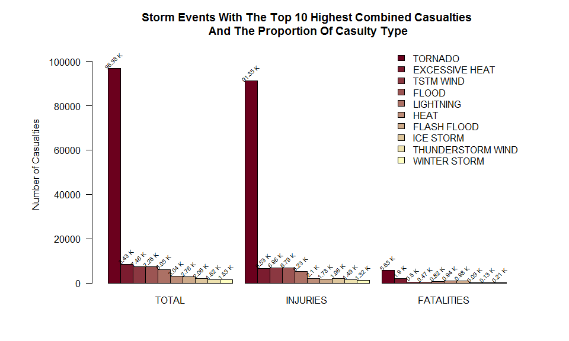
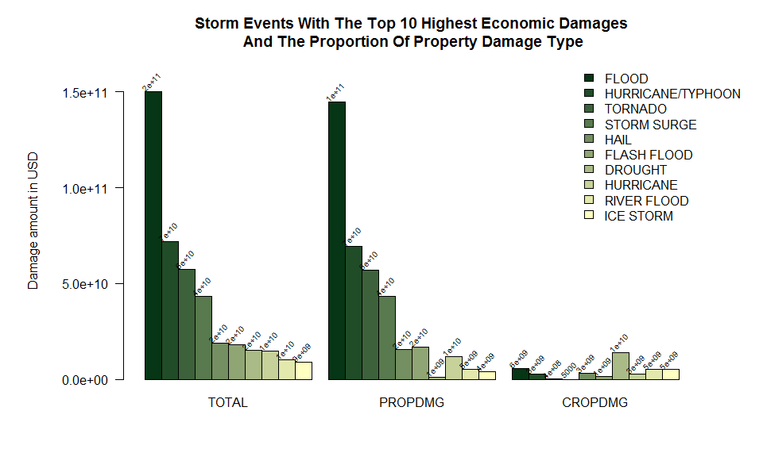

## Synopsis

This is a report of exploring the U.S. National Oceanic and Atmospheric Administration's (NOAA) storm database and analysis corresponding to most disaster storm event impacts in United States on public health and economic consequences. The database tracks the characteristics of major storms and weather events in the United States. The data was collected during the period from 1950 through 2011. In specific there are two questions that have been tried to answer through this analysis:

1. Across the United States, which type of events are most harmful with respect to population health?
2. Across the United States, which type of events have the greatest economic consequences?

After the analysis of storm data events it was found that Tornado causes the most public health impact, while Flood causes the most economic impact in relation to crop and property damage.

## Table of Contents

* [Data Processing](#data-processing)  
    * [Retrieval and Loading Data](#retrieval-and-loading-data)  
    * [Data Analysis](#data-analysis)  
    * [Variable of Interest](#variable-of-interest) 
  
* [Results](#results)  
    * [Storm events that have most impact on public health](#storm-events-that-have-most-impact-on-public-health)
      * [Plot 1: Impact of storm events on public health](#plot-1-impact-of-storm-events-on-public-health)
    * [Storm events that have most impact on economic consequences](#storm-events-that-have-most-impact-on-economic-consequences)
      * [Plot 2: Impact of storm events on economic consequences](#plot-2-impact-of-storm-events-on-economic-consequences)

* [Summary](#summary)
    
## Data Processing

### Retrieval and Loading Data

The [Storm Events Database](http://www.ncdc.noaa.gov/stormevents/ftp.jsp) on which the analysis is performed, provided by [National Climatic Data Center](http://www.ncdc.noaa.gov/). The compressed data can be downloaded from the [source URL](https://d396qusza40orc.cloudfront.net/repdata%2Fdata%2FStormData.csv.bz2). Furthermore the documentation details of the data can be found [here](https://d396qusza40orc.cloudfront.net/repdata%2Fpeer2_doc%2Fpd01016005curr.pdf).

- Loading required packages for data analysis.


```r
library(dplyr)
library(knitr)
```

- Downloading dataset and loading into a data frame


```r
filename <- "StormData.csv.bz2"

if(!file.exists("./data")) {
  dir.create("./data")
  fileUrl <- "https://d396qusza40orc.cloudfront.net/repdata%2Fdata%2FStormData.csv.bz2"
  print("Downloading File.....")
  download.file(fileUrl, destfile = paste("./data/", filename))
  print("File Downloaded Successfully!")
}

# Reading dataset into a data frame
storm_df <- read.csv(paste("./data/", filename), na.strings = c("", " ", "NA"))
```

### Data Analysis

- There are __902297__ observations and __37__ variables in the data frame.


```r
dim(storm_df)
```

```
## [1] 902297     37
```

- Examining variable names.


```r
names(storm_df)
```

```
##  [1] "STATE__"    "BGN_DATE"   "BGN_TIME"   "TIME_ZONE"  "COUNTY"    
##  [6] "COUNTYNAME" "STATE"      "EVTYPE"     "BGN_RANGE"  "BGN_AZI"   
## [11] "BGN_LOCATI" "END_DATE"   "END_TIME"   "COUNTY_END" "COUNTYENDN"
## [16] "END_RANGE"  "END_AZI"    "END_LOCATI" "LENGTH"     "WIDTH"     
## [21] "F"          "MAG"        "FATALITIES" "INJURIES"   "PROPDMG"   
## [26] "PROPDMGEXP" "CROPDMG"    "CROPDMGEXP" "WFO"        "STATEOFFIC"
## [31] "ZONENAMES"  "LATITUDE"   "LONGITUDE"  "LATITUDE_E" "LONGITUDE_"
## [36] "REMARKS"    "REFNUM"
```

- There are __6645765__ missing values which is __19%__ of the total dataset.


```r
sum(is.na(storm_df))
```

```
## [1] 6645765
```

```r
mean(is.na(storm_df)) * 100
```

```
## [1] 19.90645
```

- Individual missing values of variables are shown below: 


```r
sapply(storm_df, FUN = function(x) sum(is.na(x)))
```

```
##    STATE__   BGN_DATE   BGN_TIME  TIME_ZONE     COUNTY COUNTYNAME      STATE 
##          0          0          0          0          0       1589          0 
##     EVTYPE  BGN_RANGE    BGN_AZI BGN_LOCATI   END_DATE   END_TIME COUNTY_END 
##          0          0     547332     287743     243411     238978          0 
## COUNTYENDN  END_RANGE    END_AZI END_LOCATI     LENGTH      WIDTH          F 
##     902297          0     724837     499225          0          0     843563 
##        MAG FATALITIES   INJURIES    PROPDMG PROPDMGEXP    CROPDMG CROPDMGEXP 
##          0          0          0          0     465934          0     618413 
##        WFO STATEOFFIC  ZONENAMES   LATITUDE  LONGITUDE LATITUDE_E LONGITUDE_ 
##     142069     248769     594029         47          0         40          0 
##    REMARKS     REFNUM 
##     287489          0
```

### Variable of Interest

The NOAA dataset has __37__ variables, but not all of them fall into the scope of this report, which focuses on knowing the human and economic damages caused by reported weather events. Knowing beforehand which variables to be used will speed-up the data processing and analysis.

There are __7__ variables relevant to this data analysis project, which should to be extracted from the dataset.

1. `EVTYPE` --> Different types of storm events recorded to the dataset.
2. `FATALITIES` --> The number of human live cost due to individual types of storm event.
3. `INJURIES` --> The number of injuries occur due to individual types of storm event.
4. `PROPDMG` --> The amount of property damage in order of magnitude (USD)
5. `PROPDMGEXP` --> The order of magnitude for property damage (e.g. __K__ for thousands)
6. `CROPDMG` --> The amount of crop damage in order of magnitude (USD)
7. `CROPDMGEXP` --> The order of magnitude for crop damage (e.g. __M__ for millions)

The subset should also focus on discard information where there is no necessity of specific information according to the analysis criterion. 


```r
# Subsetting data frame according to the criterion
storm_df <- c("EVTYPE", 
               "FATALITIES", 
               "INJURIES", 
               "PROPDMG", 
               "PROPDMGEXP", 
               "CROPDMG", 
               "CROPDMGEXP") %>% 
  subset(storm_df, select = .) %>% 
  subset(., subset = EVTYPE != "?" & (FATALITIES > 0 | 
           INJURIES > 0 | 
           PROPDMG > 0 | 
           CROPDMG > 0))
```

- The new subset have now __254632__ observations of __7__ variables.


```r
dim(storm_df)
```

```
## [1] 254632      7
```

- The new subset have now __164248__ missing values which is __9%__ of the new subset data frame. The percentage of missing values decreases __10%__ from the missing values of original dataset proportionately, which previously was  __19%__ of the dataset.


```r
sum(is.na(storm_df))
```

```
## [1] 164248
```

```r
mean(is.na(storm_df)) * 100
```

```
## [1] 9.214867
```

- Analysis of two magnitude column `PROPDMGEXP` and `CROPDMGEXP`, where: 
  - 'B/b' stands for billions
  - 'M/m' stands for millions
  - 'K/k' stands for thousands
  - 'H/h' stands for hundreds etc.


```r
table(storm_df$PROPDMGEXP)
```

```
## 
##      -      +      0      2      3      4      5      6      7      B      h 
##      1      5    210      1      1      4     18      3      3     40      1 
##      H      K      m      M 
##      6 231427      7  11320
```

```r
table(storm_df$CROPDMGEXP)
```

```
## 
##     ?     0     B     k     K     m     M 
##     6    17     7    21 99932     1  1985
```

For further analysis and calculation, the scale of the variable `PROPDMGEXP` and `CROPDMGEXP` need to uniformly scaled. Such that: 

- "+" --> 10e0
- "-" --> 10e0
- "?" --> 10e0
- "number" --> 10e(number)
- B/b --> billion : 10e(9)
- M/m --> million : 10e(6)
- K/k --> thousand: 10e(3)
- H/h --> hundred : 10e(2)

To convert the exponential character into multiplication number, the function `exp_factor` perform the necessary operation to make the dataset usable for further calculation. It converts the exponential character into numeric values.


```r
exp_factor <- function(x){
  ifelse(x %in% c("+","-","?"), 10^0, # in 1
         ifelse(x %in% as.character(0:8), 10^as.numeric(x), # in exponentiation to the value
                ifelse(x %in% c("b","B"), 10^9, # in billion 
                       ifelse(x %in% c("m","M"), 10^6, # in million
                              ifelse(x %in% c("k","K"), 10^3, # in thousands 
                                     ifelse(x %in% c("h","H"), 10^2, # in hundreds 
                                            1)))))) # everything else 1
}
```

- The corresponding `PROPDMG` and `CROPDMG` is replaced with the multiplication of converted exponential value


```r
storm_df$PROPDMG <- storm_df$PROPDMG * exp_factor(storm_df$PROPDMGEXP)
storm_df$CROPDMG <- storm_df$CROPDMG * exp_factor(storm_df$CROPDMGEXP)
```

## Results

### Storm events that have most impact on public health

By aggregate the reported casualties which is calculated by adding `FATALITIES` and `INJURIES` corresponding to storm event type `EVTYPE`, a new data frame is created which eventually get the required result of the analysis. The data frame is ordered in with top ten most impacts of storm events on public health by combined casualties.


```r
life_dmg <- aggregate(
  cbind(
    FATALITIES + INJURIES, INJURIES, FATALITIES) ~ EVTYPE , data=storm_df, FUN=sum) %>%
  .[order(-.[, 2]), ] %>% .[1:10, ] 

row.names(life_dmg) <- NULL # Removing row indexes
names(life_dmg)[2] <- "TOTAL" # Renaming column name
kable(x=life_dmg, caption = "Table 1: Storm events that have most impact on public health") # Generating Table
```


Table: Table 1: Storm events that have most impact on public health

|EVTYPE            | TOTAL| INJURIES| FATALITIES|
|:-----------------|-----:|--------:|----------:|
|TORNADO           | 96979|    91346|       5633|
|EXCESSIVE HEAT    |  8428|     6525|       1903|
|TSTM WIND         |  7461|     6957|        504|
|FLOOD             |  7259|     6789|        470|
|LIGHTNING         |  6046|     5230|        816|
|HEAT              |  3037|     2100|        937|
|FLASH FLOOD       |  2755|     1777|        978|
|ICE STORM         |  2064|     1975|         89|
|THUNDERSTORM WIND |  1621|     1488|        133|
|WINTER STORM      |  1527|     1321|        206|

#### Plot 1: Impact of storm events on public health

The following panel plot of barcharts is a graphical representation of top ten most harmful storm event impacts on public health. It describes the impact by top ten total casualties as well as the proportion of individual type of casualty.


```r
options(scipen=1) # Setting limit of scientific notation appearing probability

pal <- colorRampPalette(colors = c("#6b001d", "#ffffc1"))(10) # Defining color palette
par(mar = c(5.1, 8.1, 4.1, 4.1)) # Setting margin

b4 <- barplot(as.matrix(life_dmg[, 2:4]), col=pal, 
              las = 1, beside = T, 
              main = "Storm Events With The Top 10 Highest Combined Casualties\n And The Proportion Of Casulty Type", 
              ylab = "", legend = life_dmg$EVTYPE, 
              args.legend = list(x = "topright", bty = 'n', inset=c(0, 0)), 
              ylim = c(0, 1.1 * max(life_dmg[, 2])))

text(x = b4, 
     y = as.matrix(life_dmg[order(-life_dmg[, 2]), ][, 2:4]),
     labels = paste(as.character(
       as.matrix(round(
         life_dmg[order(-life_dmg[, 2]), ][, 2:4]/1000, 2))), 'K'), 
     pos = 3, cex = 0.6, srt =45)

mtext("Number of Casualties", line = 4.5, side = 2)
```



### Storm events that have most impact on economic consequences

By aggregate the reported damage amount in USD which is calculated by adding `PROPDMG` and `CROPDMG` corresponding to storm event type `EVTYPE`, a new data frame is created which eventually get the required result of the analysis. The data frame is ordered in with top ten most impacts of storm events on economic consequences by combined damages which includes both property damages and crop damages.


```r
eco_dmg <- aggregate(
  cbind(
    PROPDMG + CROPDMG, PROPDMG, CROPDMG) ~ EVTYPE , data=storm_df, FUN=sum) %>% 
  .[order(-.[, 2]), ] %>% .[1:10, ]

row.names(eco_dmg) <- NULL # Removing row indexes
names(eco_dmg)[2] <- "TOTAL" # Renaming column name
kable(x=eco_dmg, caption = "Table 2: Storm events that have most impact on economic consequences") # Generating Table
```


Table: Table 2: Storm events that have most impact on economic consequences

|EVTYPE            |        TOTAL|      PROPDMG|     CROPDMG|
|:-----------------|------------:|------------:|-----------:|
|FLOOD             | 150319678257| 144657709807|  5661968450|
|HURRICANE/TYPHOON |  71913712800|  69305840000|  2607872800|
|TORNADO           |  57362333947|  56947380677|   414953270|
|STORM SURGE       |  43323541000|  43323536000|        5000|
|HAIL              |  18761221986|  15735267513|  3025954473|
|FLASH FLOOD       |  18243991079|  16822673979|  1421317100|
|DROUGHT           |  15018672000|   1046106000| 13972566000|
|HURRICANE         |  14610229010|  11868319010|  2741910000|
|RIVER FLOOD       |  10148404500|   5118945500|  5029459000|
|ICE STORM         |   8967041360|   3944927860|  5022113500|

### Plot 2: Impact of storm events on economic consequences

The following panel plot of barcharts is a graphical representation of top ten most harmful storm event impacts on economic consequences. It describes the impact by top ten total damages which includes both property damages and crop damages as well as the proportion of individual type of damages - property damages and crop damages in USD.


```r
pal2 <- colorRampPalette(colors = c("#063615", "#ffffc1"))(10) # Defining color palette
par(mar = c(5.1, 8.1, 4.1, 4.1)) # Setting margin

b5 <- barplot(as.matrix(eco_dmg[, 2:4]), col=pal2, 
              las = 1, beside = T, 
              main = "Storm Events With The Top 10 Highest Economic Damages\n And The Proportion Of Property Damage Type", 
              ylab = "", legend = eco_dmg$EVTYPE, 
              args.legend = list(x = "topright", bty = 'n',inset=c(-0.08,0)),
              ylim = c(0, 1.1 * max(eco_dmg[, 2])))

text(x = b5, 
     y = as.matrix(eco_dmg[order(-eco_dmg[, 2]), ][, 2:4]),
     labels = 
       as.matrix(signif(
         eco_dmg[order(-eco_dmg[, 2]), ][, 2:4], digits=1)), 
     pos = 3, cex = 0.6, srt =45)

mtext("Damage amount in USD", line = 5.5, side = 2)
```



## Summary

Through the analysis it is found that the storm event type which have most impact on public health are:

1. TORNADO
2. EXCESSIVE HEAT
3. TSTM WIND
4. FLOOD
5. LIGHTNING and so on.

Whereas the storm event type which have most impact on economic consequences are:

1. FLOOD
2. HURRICANE/TYPHOON
3. TORNADO
4. STORM SURGE
5. HAIL and so on.


