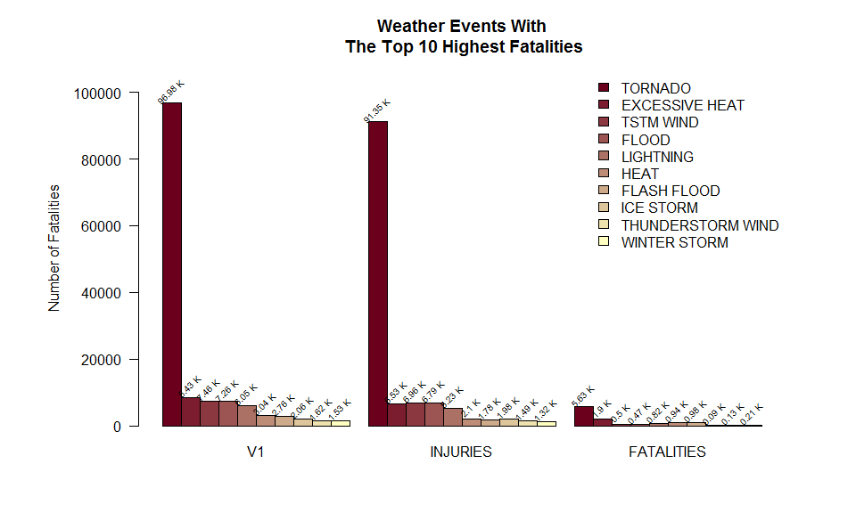
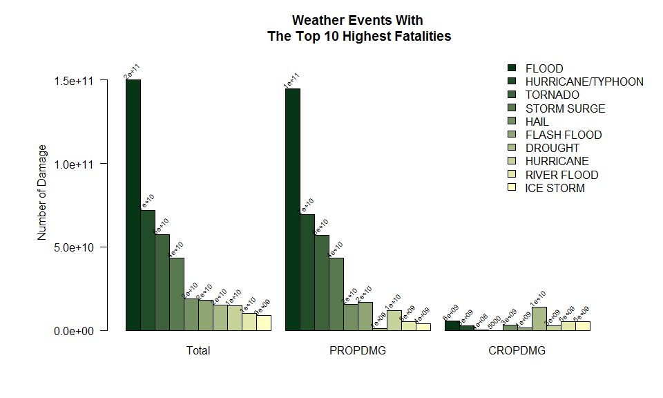

## Synopsis

This is an R Markdown document. Markdown is a simple formatting syntax for authoring HTML, PDF, and MS Word documents. For more details on using R Markdown see <http://rmarkdown.rstudio.com>.

When you click the **Knit** button a document will be generated that includes both content as well as the output of any embedded R code chunks within the document. You can embed an R code chunk like this:


```r
library(dplyr)
```

```
## 
## Attaching package: 'dplyr'
```

```
## The following objects are masked from 'package:stats':
## 
##     filter, lag
```

```
## The following objects are masked from 'package:base':
## 
##     intersect, setdiff, setequal, union
```

```r
library(knitr)
filename <- "StormData.csv.bz2"
storm_df <- read.csv(paste("./data/", filename), na.strings = c("", " ", "NA"))

storm_sub <- c("EVTYPE", 
               "FATALITIES", 
               "INJURIES", 
               "PROPDMG", 
               "PROPDMGEXP", 
               "CROPDMG", 
               "CROPDMGEXP") %>% 
  subset(storm_df, select = .) %>% 
  subset(., subset = EVTYPE != "?" & (FATALITIES > 0 | 
           INJURIES > 0 | 
           PROPDMG > 0 | 
           CROPDMG > 0))

storm_sub2 <- subset(storm_sub, subset = FATALITIES > 0 | 
                       INJURIES > 0 | 
                       PROPDMG > 0 | 
                       CROPDMG > 0)
exp_factor <- function(x){
  ifelse(x %in% c("+","-","?"), 10^0,
    ifelse(x %in% as.character(0:8), 10^as.numeric(x),
           ifelse(x %in% c("b","B"), 10^9,    # billion
                  ifelse(x %in% c("m","M"), 10^6,    # million/mega
                         ifelse(x %in% c("k","K"), 10^3,    # kilo   
                                ifelse(x %in% c("h","H"), 10^2,    # hecto
                                       1))))))
}
df_copy <- storm_sub
df_copy$PROPDMG <- df_copy$PROPDMG * exp_factor(df_copy$PROPDMGEXP)
```

```
## Warning in ifelse(x %in% as.character(0:8), 10^as.numeric(x), ifelse(x %in% :
## NAs introduced by coercion
```

```r
df_copy$CROPDMG <- df_copy$CROPDMG * exp_factor(df_copy$CROPDMGEXP)
```

```
## Warning in ifelse(x %in% as.character(0:8), 10^as.numeric(x), ifelse(x %in% :
## NAs introduced by coercion
```

```r
fatalities <- aggregate(cbind(FATALITIES + INJURIES, INJURIES, FATALITIES) ~ EVTYPE , data=df_copy, FUN=sum) 
fatalities <- fatalities[order(fatalities[, 2], decreasing = TRUE), ]
MaxFatalities <- fatalities[1:10, ]
print(MaxFatalities)
```

```
##                EVTYPE    V1 INJURIES FATALITIES
## 406           TORNADO 96979    91346       5633
## 60     EXCESSIVE HEAT  8428     6525       1903
## 422         TSTM WIND  7461     6957        504
## 85              FLOOD  7259     6789        470
## 257         LIGHTNING  6046     5230        816
## 150              HEAT  3037     2100        937
## 72        FLASH FLOOD  2755     1777        978
## 237         ICE STORM  2064     1975         89
## 363 THUNDERSTORM WIND  1621     1488        133
## 480      WINTER STORM  1527     1321        206
```

```r
pal <- colorRampPalette(colors = c("#6b001d", "#ffffc1"))(10)

par(mar = c(5.1, 8.1, 4.1, 4.1))
options(scipen=1)
b4 <- barplot(as.matrix(MaxFatalities[, 2:4]), col=pal, 
        las = 1, beside = T, 
        main = "Weather Events With\n The Top 10 Highest Fatalities", 
        ylab = "", legend = MaxFatalities$EVTYPE, 
        args.legend = list(x = "topright", bty = 'n', inset=c(0, 0)),
        ylim = c(0, 1.1 * max(MaxFatalities[, 2])))
text(x = b4, 
     y = as.matrix(MaxFatalities[order(MaxFatalities[, 2], decreasing = TRUE), ][, 2:4]),
     labels = paste(as.character(
       as.matrix(round(
         MaxFatalities[order(MaxFatalities[, 2], decreasing = TRUE), ][, 2:4]/1000, 2))), 'K'), 
     pos = 3, cex = 0.6, srt =45)
mtext("Number of Fatalities", line = 4.5, side = 2)
```

<!-- -->

```r
#ecodmg <- aggregate(cbind(PROPDMG + CROPDMG, PROPDMG, CROPDMG) ~ EVTYPE , data=df_copy, FUN=sum) 
#ecodmg <- ecodmg[order(-ecodmg[, 2]), ]
#ecodmgMax <- ecodmg[1:10, ]
#print(ecodmgMax)

ecodmgMax <- aggregate(cbind(PROPDMG + CROPDMG, PROPDMG, CROPDMG) ~ EVTYPE , data=df_copy, FUN=sum) %>%
  .[order(-.[, 2]), ] %>% .[1:10, ]

row.names(ecodmgMax) <- NULL
names(ecodmgMax)[2] <- "Total"
kable(x=ecodmgMax, caption = "Table 1")
```


Table: Table 1

|EVTYPE            |        Total|      PROPDMG|     CROPDMG|
|:-----------------|------------:|------------:|-----------:|
|FLOOD             | 150319678257| 144657709807|  5661968450|
|HURRICANE/TYPHOON |  71913712800|  69305840000|  2607872800|
|TORNADO           |  57362333947|  56947380677|   414953270|
|STORM SURGE       |  43323541000|  43323536000|        5000|
|HAIL              |  18761221986|  15735267513|  3025954473|
|FLASH FLOOD       |  18243991079|  16822673979|  1421317100|
|DROUGHT           |  15018672000|   1046106000| 13972566000|
|HURRICANE         |  14610229010|  11868319010|  2741910000|
|RIVER FLOOD       |  10148404500|   5118945500|  5029459000|
|ICE STORM         |   8967041360|   3944927860|  5022113500|

```r
pal2 <- colorRampPalette(colors = c("#063615", "#ffffc1"))(10)
par(mar = c(5.1, 8.1, 4.1, 4.1))
b5 <- barplot(as.matrix(ecodmgMax[, 2:4]), col=pal2, 
              las = 1, beside = T, 
              main = "Weather Events With\n The Top 10 Highest Fatalities", 
              ylab = "", legend = ecodmgMax$EVTYPE, 
              args.legend = list(x = "topright", bty = 'n', inset=c(-0.08,0)),
              ylim = c(0, 1.1 * max(ecodmgMax[, 2])))
text(x = b5, 
     y = as.matrix(ecodmgMax[order(-ecodmgMax[, 2]), ][, 2:4]),
     labels = 
       as.matrix(signif(
         ecodmgMax[order(-ecodmgMax[, 2]), ][, 2:4], digits=1)), 
     pos = 3, cex = 0.6, srt =45)
mtext("Number of Damage", line = 4.5, side = 2)
```

<!-- -->

## Including Plots

